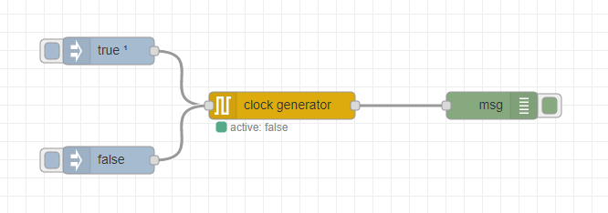

# node-red-contrib-clock-generator

A controlled clock generator for Node-RED that runs through the individual clock cycles with the set period duration.

Features:

- Controllable by incoming messages
- Period duration adjustable
- Format of outgoing messages configurable

## Installation

Open Node-RED and select `Manage palette` from main menu to open the Palette Manager. Go to the `Install` tab, search for `node-red-contrib-clock-generator` and click `install`.

Alternatively, you can run the following command in your Node-RED user directory (typically `~/.node-red`):

```
npm i node-red-contrib-clock-generator
```

## Example



```
[{"id":"326bfbe7.271314","type":"inject","z":"17eca5d8.20defa","name":"","topic":"","payload":"true","payloadType":"bool","repeat":"","crontab":"","once":true,"onceDelay":0.1,"x":390,"y":260,"wires":[["96d9f18.76d2d1"]]},{"id":"afc534f7.68eea8","type":"debug","z":"17eca5d8.20defa","name":"","active":true,"tosidebar":true,"console":false,"tostatus":false,"complete":"true","targetType":"full","x":810,"y":320,"wires":[]},{"id":"96d9f18.76d2d1","type":"clock-generator","z":"17eca5d8.20defa","name":"","topic":"","period":"1","output":"1","x":580,"y":320,"wires":[["afc534f7.68eea8"]]},{"id":"131aa7b5.9dd488","type":"inject","z":"17eca5d8.20defa","name":"","topic":"","payload":"false","payloadType":"bool","repeat":"","crontab":"","once":false,"onceDelay":0.1,"x":390,"y":380,"wires":[["96d9f18.76d2d1"]]}]
```

## License

[MIT](LICENSE)